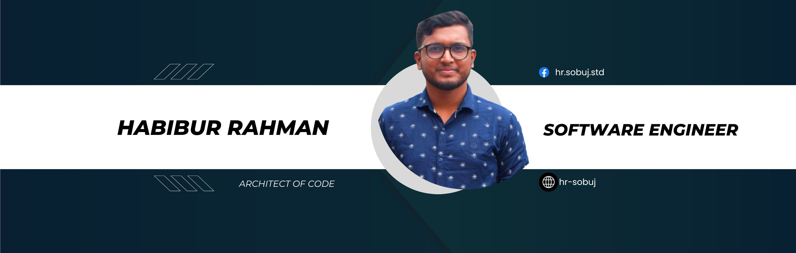

# Hi, I'm Habibur Rahman 👋
**Software Engineer | Backend & Full-Stack Development Enthusiast**

I'm a dedicated Software Engineer from 🇧🇩 Bangladesh, passionate about building efficient, scalable, and user-friendly applications.  
I focus on writing clean code, learning cutting-edge technologies, and solving real-world problems.

## 🛠️ Skills & Technologies

**Languages & Frameworks**  

**Databases**  

**Tools & Platforms**  

## 💼 Experience

- **Software Engineer** – [Gigalogy](https://gigalogy.com/) _(June 2024 – Present)_  
  Working on scalable backend services, APIs, and microservices with a focus on performance and security.

- **Trainee Associate Software Engineer** – [Softzino Technologies](https://softzino.com/) _(Dec 2023 – Feb 2024)_  
  Applied Data Structures, Algorithms, OOP, SOLID principles, and design patterns in real-world projects.

- **Full Stack Web Developer** – [Employin](https://employin.co/) _(Dec 2022 – Oct 2023)_  
  Built and maintained MERN stack applications, ensuring smooth deployment and server maintenance.

## 🚀 Notable Projects

- **Student Aid** – Fundraising platform for underprivileged students.  
  _Node.js, Express.js, React.js, MongoDB_  
  [Backend](https://github.com/hr-sobuj/student-aid-api) | [Frontend](https://github.com/hr-sobuj/student-aid-frontend) | [Live](https://student-aid-frontend-gilt.vercel.app/)

- **Project Management App** – Track developer activity, project progress, and reports.  
  _Django REST Framework, React.js_  
  [Backend](https://github.com/hr-sobuj/project-management-api) | [Frontend](https://github.com/hr-sobuj/project-management-frontend) | [Live](https://project-management-frontend-two.vercel.app/)

- **Chat Application** – Real-time chat app with custom authentication.  
  _Node.js, Express.js, MongoDB, Socket.io_  
  [Repo](https://github.com/hr-sobuj/chat-application) | [Live](http://chat-application.hrsobuj.com/)

## 📊 GitHub Stats

<!--   
  
 -->

  
  
  

## 📫 Contact

  
📧 Email: [sobuj.hrs@gmail.com](mailto:sobuj.hrs@gmail.com)

