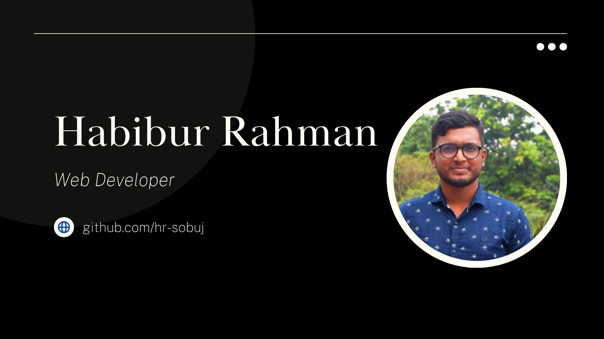

## Hey, Tech wizard! 

I'm Habibur, a Full Stack Web Developer from  Bangladesh. I dedicate the majority of my time to coding and immersing myself in technology by reading articles and documentation, striving to stay at the forefront of the ever-evolving tech landscape.

🌐 Connect with me!

     

🌱 &emsp;Dedicated to programming and knowledge sharing.

💻 &emsp;My go-to lines of code: `cout<<"hello world!"<<endl;` and `console.log("hello world")`.

🤝 &emsp;I'm actively seeking opportunities to contribute to open source projects and create innovative solutions.

📬 &emsp;Feel free to contact me at sobuj.hrs@gmail.com.

🔬 &emsp;Passionate about critical thinking, mastering new technologies, and, above all, coding.

### Skills

**Languages:** 
   
**Framework:** 
    
**Database:** 
    
**Tools:** 
      

### Work Experience

- **Full Stack Web Developer**  
  - [Employin](https://employin.co/), Remote, Part-time  
  - December 2022 – Present
    - Full-stack web developer experienced in MERN stack, with a primary focus on Node.js, Express.js, and React.js.
    - Responsible for server maintenance and smooth operation.
    - Proficient in both frontend and backend development.

- **Full Stack Web Developer**  
  - [SageByte](https://www.sagebyte.co/), Remote, Part-time 
  - May 2022 - October 2022
    - Collaborated in a team to develop visually appealing, responsive websites.
    - Translated design mockups into functional interfaces using HTML, CSS, Tailwind CSS, and React.js to create an engaging user experience.
    - Optimized frontend performance for faster loading.

### Programming Skill

- Solved more than **400+** programming problems on several online judges like Leetcode, Codeforces, URI Online Judge, etc.
- **Online Judges Handles:**

      

#### Talks about

          

### Personal Projects

<table>
    <tr>
        <th>Project Name</th>
        <th>Description</th>
        <th>Technologies</th>
        <th>Links</th>
    </tr>
    <tr>
        <td>Student Aid</td>
        <td>A comprehensive platform developed using Node.js, Express.js, and React.js to support financially disadvantaged students in fundraising for their education. It employs MongoDB with Mongoose for data storage and implements a robust Student Verification System. Additionally, it integrates a secure Payment Gateway using SSLCOMMERZ for safe transactions.</td>
        <td>Node.js, Express.js, React.js, MongoDB, Mongoose</td>
        <td><a href="https://github.com/hr-sobuj/student-aid-api">Backend</a>, <a href="https://github.com/hr-sobuj/student-aid-frontend">Frontend</a>, <a href="https://student-aid-frontend-gilt.vercel.app/">Live</a></td>
    </tr>
    <tr>
        <td>Project Management Application</td>
        <td>Track developer activity and project progress with the Django Rest Framework backend and React.js frontend. Developers update project status; managers create projects, assign developers, and generate work reports. Focus on scalability, performance, and user-friendly project visualization.</td>
        <td>Django Rest Framework, React.js</td>
        <td><a href="https://github.com/hr-sobuj/project-management-api.git">Backend</a>, <a href="https://github.com/hr-sobuj/project-management-frontend.git">Frontend</a>,  <a href="https://project-management-frontend-two.vercel.app/">Live</a></td>
    </tr>
    <tr>
        <td>Chat Application</td>
        <td>A live chat application developed with Node.js, Express.js, and Ejs for server-side development. It uses MongoDB with Mongoose for data storage and Socket.io for concurrent user connections. Custom authentication is implemented using pure Node.js, and JWT generation ensures security.</td>
        <td>Node.js, Express.js, Ejs, MongoDB, Socket.io</td>
        <td><a href="https://github.com/hr-sobuj/chat-application">Backend</a>, <a href="http://chat-application.hrsobuj.com/">Live</a></td>
    </tr>
    <tr>
        <td>Quiz Application</td>
        <td>An authentication-based quiz application that allows users to play quizzes and provides detailed results with correct answers. It's built using React.js and utilizes Firebase for smooth functionality.</td>
        <td>React.js, Firebase</td>
        <td><a href="https://jovial-lovelace-ec3130.netlify.app/">Live</a></td>
    </tr>
    <tr>
        <td>CGPA Calculator</td>
        <td>A user-friendly tool for easily calculating GPA and CGPA. It also offers the ability to design a cover page for university students. The project is built using React.js, providing a responsive and intuitive experience.</td>
        <td>React.js</td>
        <td><a href="https://cgpa-calculator-hstu.vercel.app/">Live</a></td>
    </tr>
    <tr>
        <td>Madrasatus Suffah</td>
        <td>A school website with authentication features for teachers. Teachers have access to a dashboard where they can perform various activities, including publishing notices and sharing results. The platform is built using Django, ensuring a secure and efficient environment.</td>
        <td>Django</td>
        <td><a href="http://madrasatus-suffah.hrsobuj.com/">Live</a></td>
    </tr>
    <tr>
        <td>Publication</td>
        <td>A simple online bookshop where users can browse and purchase books. It offers a user-friendly interface and secure transactions, making it easy for anyone to find and buy books they desire.</td>
        <td>Django</td>
        <td><a href="http://publication.hrsobuj.com/">Live</a></td>
    </tr>
    <tr>
        <td>HSTU Transport System</td>
        <td>A bus schedule system designed for HSTU students. Students can access updated bus schedules and request or acquire bus services from the university administration. The system is built using React.js and Firebase for efficient functionality.</td>
        <td>React.js, Firebase</td>
        <td><a href="https://transport-management-system.vercel.app/">Live</a></td>
    </tr>
    <tr>
        <td>Blood Bank Management</td>
        <td>A simple blood bank system that allows users to search for blood donors and register as donors. It facilitates a crucial aspect of healthcare by connecting those in need of blood with willing donors. The system is built using React.js and Firebase for efficiency.</td>
        <td>React.js, Firebase</td>
        <td><a href="https://blood-donation-system-three.vercel.app/">Live</a></td>
    </tr>
    <tr>
        <td>Dashboard</td>
        <td>A simple and elegant dashboard layout that can be customized for various purposes. It's built using Next.js for a responsive and efficient design.</td>
        <td>Next.js</td>
        <td><a href="https://admin-panel-reactjs-tailwindcss.vercel.app/">Live</a></td>
    </tr>
    <tr>
        <td>Portfolio Template</td>
        <td>A clean and minimalistic portfolio template, ideal for showcasing your work and personal projects. It's built using HTML and CSS for easy customization.</td>
        <td>HTML, CSS</td>
        <td><a href="https://habibur-rahman-sobuj-frontend.vercel.app/">Live</a></td>
    </tr>
    <tr>
        <td>Burger Builder</td>
        <td>A fun and interactive React.js project that allows users to create custom burgers. It's integrated with Firebase for real-time data storage, creating an engaging experience for users.</td>
        <td>React.js, Firebase</td>
        <td><a href="https://burger-builder-3abd7.web.app/">Live</a></td>
    </tr>
    <tr>
        <td>eCommerce Template Design</td>
        <td>A sleek and modern design for an online store. It's crafted using HTML and CSS, providing a visually appealing and functional template for e-commerce businesses.</td>
        <td>HTML, CSS</td>
        <td><a href="https://hr-sobuj.github.io/eCommerce/">Live</a></td>
    </tr>
    <tr>
        <td>Blog Template Design</td>
        <td>An elegant and user-friendly layout for bloggers. With its clean design and HTML/CSS foundation, it's a great choice for sharing your thoughts and content online.</td>
        <td>HTML, CSS</td>
        <td><a href="https://hr-sobuj.github.io/blog/">Live</a></td>
    </tr>
</table>

### Open Source Projects & Contributions

- **Express Auth Guard**
   

  **Overview** 
  `Express Auth Guard` is an NPM package designed to enhance security and user authentication within Express.js applications. My recent contribution to this project aimed to improve its functionality and overall codebase.

### Contact

:mailbox_with_mail: &emsp;[sobuj.hrs@gmail.com](mailto:sobuj.hrs@gmail.com)

:mailbox_with_mail: &emsp;[sobujhd@gmail.com](mailto:sobujhd@gmail.com)

### Education

- **Bachelor of Computer Science and Engineering (CSE)**
  - Hajee Mohammad Danesh Science and Technology University, Dianjpur.
  - Major: Computer Science and Engineering (CSE)
  - Graduation Date: November 2023

